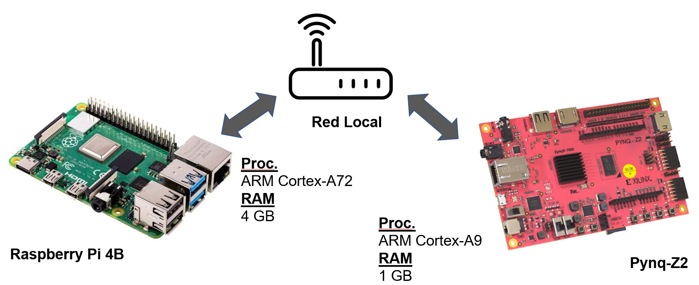

# Kyber-SW

2024-02-28 - Eros Camacho-Ruiz (camacho@imse-cnm.csic.es)

This is the repository of the evaluation carried out in the Kyber cryptosystem that is the research starting point of the ML-KEM cryptosystem 
in the [QUBIP](https://qubip.eu/) project.
The idea was to create a demo to stablish a secured communication between two devices.

<!-- TABLE OF CONTENTS -->
## Table of Contents
  <ol>
    <li><a href="#dir-struc">Directory structure</a></li>
    <li><a href="#ip-integ">IP Integration</a></li>
	<li><a href="#ins-demo">Installation and Use of the Demo</a></li>
	<li><a href="#example">Example of the Demo</a></li>
    <li><a href="#note">Note for version</a></li>
    <li><a href="#contact">Contact</a></li>
	<li><a href="#developers">Developers</a></li>
  </ol>

## Directory structure <a name="dir-struc"></a>

- kyber_SW: the folder that contains the Kyber software implementation
    - data_in: stores the input ciphertext in binary format when the demo is running.
    - data_out: stores the output ciphertext in binary format when the demo is running.
    - gen_keys: stores the generated keys.
    - pub_keys: stores the public keys of the devices to connect.
    - kyber: source files
        - common: extra functions 
        - src: Kyber SW libraries	(ML-KEM)
    - Makefile: to generate the executables for the library
    - demo.c: main file to demo
- README.md: this file 

## Installation and Use of the Demo <a name="ins-demo"></a>

The main idea of the Demo is to interconnect two devices and share information using PQC (Kyber) as the next figure shows. In this case, one RaspberryPi platform
and a Pynq platform are interconnected in a local network. The two of them are going to generate the key pair (public and private keys). Then, one of them is going to recive the public key of the other one using 
this key to encapsulate a shared secret. Then the ciphertext generated (with the information of the shared secret) is sent to the other platform that will use the 
private key to decapsulate and extract the shared secret. 



1. For compilation of a specific demo:

```bash
make demo_XXXX
```

where `XXX` can be: `kem512, kem768, kem1024, kem512-90s, kem768-90s, kem1024-90s`. So, for example if the user wants to compile something related with the parameter set `kyber512`, 
they must issue: `make demo_kem512`

2. For the use, the program has different input variables:
	- `-h` : Show the help.
	- `-k` : Key generation.
	- `-e` : Encapsulation. 
	- `-d` : Decapsulation.
	
	Also it includes verbose options:
	- `-v` : verbose level level
		- `1`: Show only functions.
		- `2`: Show intermediate results.
		- `3`: Show keys.

## Example of the Demo <a name="example"></a>

There is an example in the Youtube channel of the [QUBIP](https://qubip.eu/) project: [Link](https://www.youtube.com/watch?v=EnJnb-Dg5hM). Also, 
the demo video example can be downloaded in the next [link](https://saco.csic.es/index.php/s/XZKiewmqyL4JZBt). 

For the example, two platforms will be used: #RPI-4 and #PYNQ-Z2. _It is recommended that the verbose level be 3 in order to see all the intermediate results_.

***Note: For the execution, it is mandatory to activate root privileges***. 

1. The first step is to perform the key generation in both platforms:
```bash
demo_kyber509 -k -v 2
```

2. The next step is to send the public key of the #PYNQ-Z2 to the #RPI-4:
```bash
send_pk.sh
```
*Note: the configuration set in `send_pk.sh` can be modified to the final user. It has been set to my personal set-up.*

3. The next step is to encapsulate the shared secret using the public key in the #RPI-4.
```bash
demo_kyber509 -e -v 2
```

4. The next step is to send the ciphertext generated in the below step back to the #PYNQ-Z2:
```bash
send_ct.sh
```
*Note: the configuration set in `send_ct.sh` can be modified to the final user. It has been set to my personal set-up.*

5. The next step is to recover the shared secret in the #PYNQ-Z2 decapsulating:
```bash
demo_kyber509 -d -v 2
```

At the end, it will check that both platforms share the same secrets.


## Note for version <a name="note"></a>
### v. 1.0

* Reordered the repository structure.
* Added a Readme file. 

## Contact <a name="contact"></a>

**Eros Camacho-Ruiz** - (camacho@imse-cnm.csic.es)

_Hardware Cryptography Researcher_ 

_Instituto de Microelectr�nica de Sevilla (IMSE-CNM), CSIC, Universidad de Sevilla, Seville, Spain_

## Developers <a name="developers"></a>
Eros Camacho-Ruiz

_Instituto de Microelectr�nica de Sevilla (IMSE-CNM), CSIC, Universidad de Sevilla, Seville, Spain_


